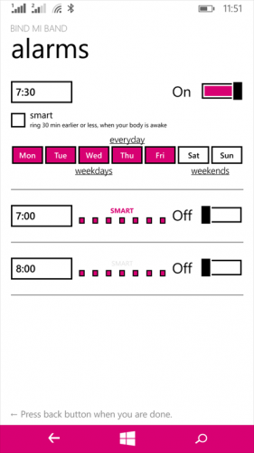
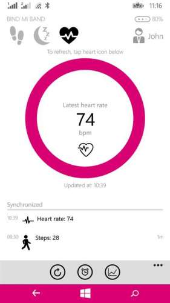
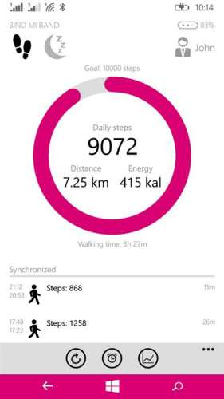
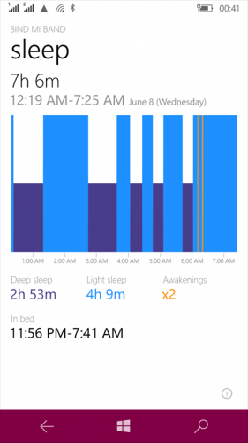
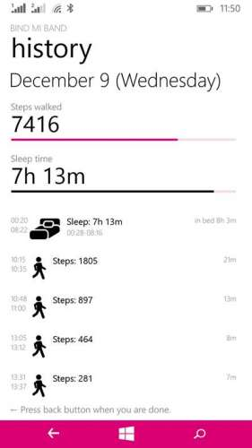
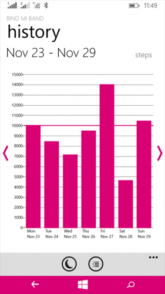

## MiBand3 vx.x.x - dev branch (MiBandApp codename)

## About 
RnD of MiBandApp, Unofficial UWP Client for Mi Band 2 ( [Windows Store link](https://apps.microsoft.com/detail/9p9p4lqh99c7?hl=ru-RU&gl=RU)  ).

## Design of WP8 retro-version (not my screenshots)

## Screenshot

## Tech details
- I found old (xap) version of MiBandApp and decompiled it via DotPeek.
- I already fixed all modules (except "main project", and XAML of Ian.Controls is still bad...).
- At now, I'm doing research of Ian's Cariburn Micro "high-level coding" to fix all MiBandApp logics (c# & xaml code). 

## Planned features (to reconstruct)
- Counting steps and setting goals
- Smart alarm clocks
- Sleep tracking (PRO function)
- Step History (PRO function)
- Display of distance traveled and calories burned (PRO function)
- Full customization of the wristband
- Pulse measurement
- Syncing your history with OneDrive
- Mi Band Firmware Update
- Running detection
- Deep/Light sleep Recognition
 
## ToDo
- Try to fix +-100500 bugs after MiBandp R.E.
- Try to add Mi Band 3,4, and 5 compatibility.

## Reference(s)
- https://github.com/superhans205/FitForMiBand Original src code (deleted by superhans205 in/at 2018)
- https://github.com/superhans205, Brave VB/C# Developer (GitHub profile page deleted)
- https://4pda.to/forum/index.php?showtopic=792038 4PDA, "Архив носимых устройств - Bind Mi Band Версия: 1.21.4.60" (Rus.)
- https://web.archive.org/web/20181224120806/http://www.bindmiband.com/ Bind Mi Band (deleted; viewing available via WayBackMachine service)
- https://bindmiband.blogspot.com/ "Shadow copy" of Bind Mi Band site (Very interesting blog about original MiBandApp "app family")

## .
As is. No support. DIY. Learn purposes only.

## ..
[m][e] April 2025