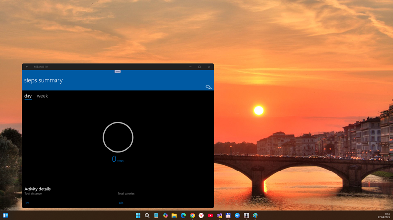

## MiBand3 v1.0-alpha - master branch

## About 
RnD of FitForMiBand, Unofficial UWP Client for Mi Band 2 ( [Windows Store link](https://apps.microsoft.com/detail/9p9p4lqh99c7?hl=ru-RU&gl=RU)  ).

FitForMiBand is some thing (uncomplete UWP app?) to control some aspects of the Xiaomi Mi Band 2... 
Ok, In 2025, I started to port ("translate") that original FitForMiBand code from VB to C# language and "upgrade" it for Xaiomi Band 3 (or even 4 and 5... idk) compatibility.

## Screenshots

## Status / progress
- Min. Win. SDK changed from 14393 to 10240 (Hello, Astoria compatibility)
- UI remake started (normal Pivot for Main page planned...)
- Draft / sketch (but at now, app already compiled and can start normally.. at minimum!)
- Only Mi Band 3 tested (battery status ok, all other parameters failed), but theoretically Band 4 and 5 can be connected… 

## ToDo
- Research GATT protocol, find all needed GUIDs...
- Fix 100500 bugs of "automatic intelligence" (AI... it's joke))
- Think of/about MiBand 4 & 5 modifications...

## Reference(s)
- https://github.com/superhans205/FitForMiBand Original src code (deleted by superhans205 in/at 2018)
- https://github.com/superhans205, Brave VB.NET Developer (GitHub profile page deleted)
- https://4pda.to/forum/index.php?showtopic=792038 4PDA, "Архив носимых устройств - Bind Mi Band Версия: 1.21.4.60" (Rus.)
- https://web.archive.org/web/20181224120806/http://www.bindmiband.com/ Bind Mi Band (deleted; viewing available via WayBackMachine service)
- https://github.com/AL3X1/FitForMiBand Fork of early FitForMiBand (Obsolete, 100500 bugs, Mi Band 3 pairing failed!)
- https://github.com/mediaexplorer74/MiBand3/tree/vb In memory of FitForMiBand =)

## .
As is. No support. DIY. Learn purposes only.

## ..
[m][e] April 2025